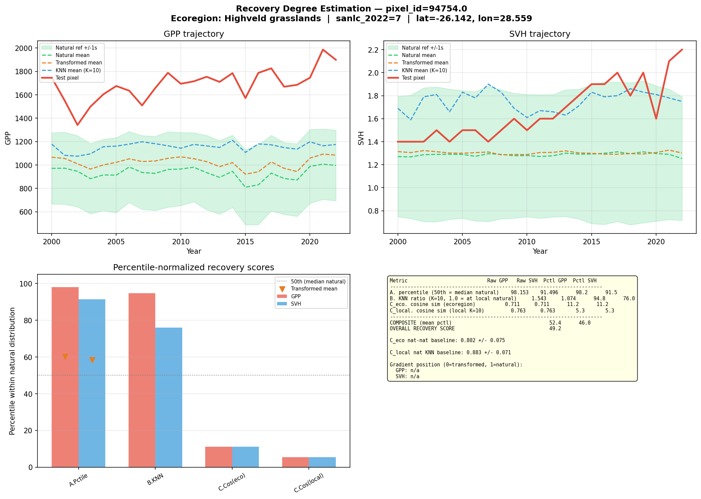
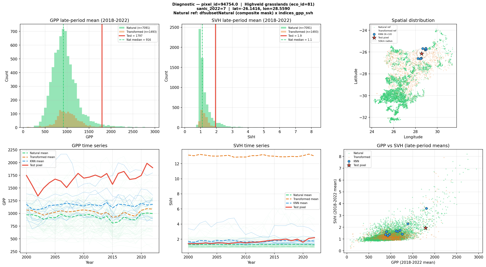
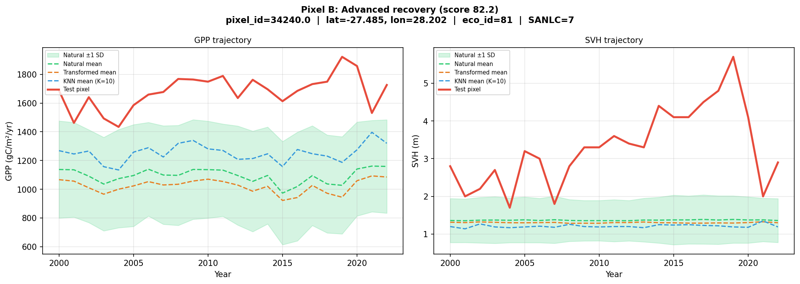
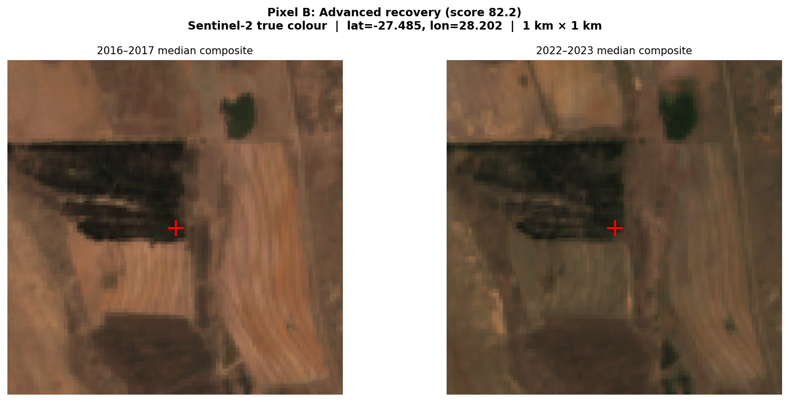
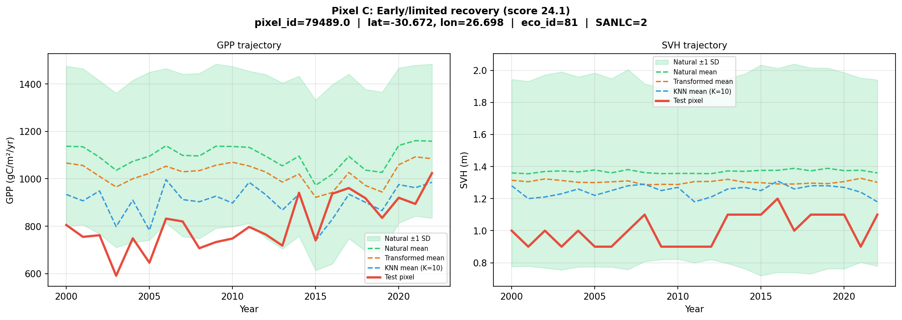
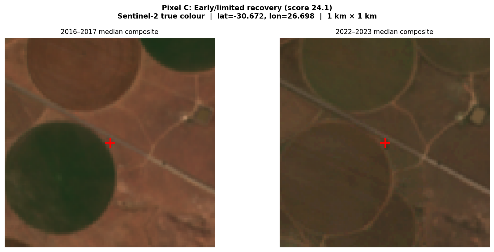

# Assessing Ecological Recovery on Abandoned Agricultural Land

## Why This Matters

When agricultural land is abandoned, vegetation may begin to recover — but how do we know if recovery is actually happening, and how far along is it? This methodology answers two questions:

1. **Is this pixel recovering, stable, or degrading?** (Trajectory classification)
2. **How recovered is it compared to intact natural areas?** (Recovery degree estimation)

We apply this across ~33 million 30 m pixels of abandoned agricultural land in South Africa, using 23 years (2000–2022) of satellite-derived vegetation data.

---

## Part 1: Classifying Trajectories

### The Indicators

We track two complementary aspects of vegetation condition over time:

- **Gross Primary Productivity (GPP)** — a measure of how much carbon vegetation is fixing through photosynthesis. This captures *functional* recovery: is the ecosystem becoming more productive? ([GEE catalog](https://developers.google.com/earth-engine/datasets/catalog/projects_global-pasture-watch_assets_ggpp-30m_v1_ugpp_m) | [Paper](https://doi.org/10.7717/peerj.19774))
- **Short Vegetation Height (SVH)** — the physical height of the vegetation canopy. This captures *structural* recovery: is vegetation biomass accumulating? ([GEE catalog](https://developers.google.com/earth-engine/datasets/catalog/projects_global-pasture-watch_assets_gsvh-30m_v1_short-veg-height_m) | [Paper](https://doi.org/10.1038/s41597-025-05739-6))

Both are derived from the Global Pasture Watch 30 m products, aggregated annually from 2000 to 2022, giving us a 23-point time series per pixel.

### Accounting for Regional Differences

A pixel in the arid Karoo naturally has lower GPP than one in subtropical KwaZulu-Natal. To make trends comparable, we standardise each pixel's time series relative to its ecoregion (using the [RESOLVE 2017 ecoregion boundaries](https://developers.google.com/earth-engine/datasets/catalog/RESOLVE_ECOREGIONS_2017) | [Paper](https://doi.org/10.1093/biosci/bix014)).

This is done through **Z-score normalisation**: for each ecoregion, we calculate the average GPP (or SVH) and the spread (standard deviation) across all pixels. Each pixel's value is then re-expressed as "how many standard deviations above or below the ecoregion average?" For example, a Z-score of +1.5 means the pixel's GPP is 1.5 standard deviations above its ecoregion average. This ensures we're asking "is this pixel trending differently from its ecological neighbours?" rather than confusing trend with baseline productivity differences between biomes.

### Detecting Trends

For each pixel, we apply two well-established methods that make no assumptions about the shape of the data distribution (called "non-parametric" methods — they work regardless of whether the data follow a bell curve or any other particular pattern):

**Theil-Sen slope** estimates the rate of change over time. Imagine drawing a line between every possible pair of years in the 23-year time series — that's 253 pairs. Each line has a slope (rate of change). The Theil-Sen estimator takes the *median* (middle value) of all 253 slopes as the overall trend. Because it uses the median rather than the mean, it is resistant to outliers — a single extreme drought year or an unusual rainfall year will not distort the estimated trend.

**Mann-Kendall test** determines whether a trend is statistically significant (i.e., unlikely to be due to chance). It works by comparing every pair of years and asking a simple question: did the value go up or down? If the later year has a higher value, that pair is scored +1; if lower, -1; if the same, 0. All the scores are summed. In a truly trendless series, roughly half the pairs would go up and half would go down, so the sum would be near zero. A large positive sum means most pairs show increases — an upward trend. The test then calculates the probability (p-value) that such a strong pattern could arise purely by chance. If the p-value is below 0.05 (i.e., less than a 5% chance of occurring randomly), we conclude the trend is real.

A pixel is classified as:

| Class | Rule |
|-------|------|
| **Recovering** | Statistically significant increasing trend (p < 0.05) |
| **Degrading** | Statistically significant decreasing trend (p < 0.05) |
| **Stable** | No significant trend detected |

We classify GPP and SVH independently, then cross-tabulate. A pixel might show functional recovery (increasing GPP) but structural stability (no change in SVH), or vice versa.

### What We Found

Across ~28.3 million abandoned-ag pixels (after excluding ~0.5 million pixels within invasive alien plant areas):

- **19.4%** show recovery in at least one indicator
- **7.3%** are recovering in both GPP and SVH simultaneously
- **63.0%** are stable in both
- **5.2%** are degrading in both

Recovery and degradation rates vary substantially across ecoregions, reflecting differences in climate, soil, land-use history, and time since abandonment.

---

## Part 2: Estimating the Degree of Recovery

Knowing *that* a pixel is recovering is useful, but we also want to know *how far along* recovery is. A pixel with a significant positive GPP trend might still be far below natural conditions, or it might have nearly converged.

### Defining "Natural"

Before measuring recovery, we need a clear definition of what counts as a natural reference site. We use a composite mask that combines four independent global datasets, requiring a pixel to satisfy **all** of the following:

- **Land classification**: classified as natural land by the [SBTN Natural Lands dataset](https://developers.google.com/earth-engine/datasets/catalog/WRI_SBTN_naturalLands_v1_1_2020) (WRI, 2020) **OR** classified as natural forest with probability >= 0.52 in the [Nature-Trace forest typology](https://developers.google.com/earth-engine/datasets/catalog/projects_nature-trace_assets_forest_typology_natural_forest_2020_v1_0_collection) ([Paper](https://doi.org/10.1038/s41597-025-06097-z))
- **Low human modification**: [Global Human Modification index](https://developers.google.com/earth-engine/datasets/catalog/CSP_HM_GlobalHumanModification) (GHM, [Kennedy et al.](https://doi.org/10.1038/s41597-025-04892-2)) <= 0.1, indicating very low human footprint — a value of 0.1 on the 0–1 scale means essentially no roads, settlements, agriculture, or other human infrastructure in the area
- **High biodiversity intactness**: [Biodiversity Intactness Index](https://gee-community-catalog.org/projects/bii_africa/) (BII) >= 0.7, confirming the ecological community remains largely intact — this means at least 70% of the original species abundance is estimated to persist

To ensure representative reference points across heterogeneous landscapes, we use **Feature Space Coverage Sampling (FSCS)**. For each ecoregion, a 10 km grid is laid over the region. Within each grid cell, [AlphaEarth](https://developers.google.com/earth-engine/datasets/catalog/GOOGLE_SATELLITE_EMBEDDING_V1_ANNUAL) embeddings are clustered into 100 groups using KMeans, and the pixel closest to each cluster centroid is selected as a sample point. This ensures coverage across the full range of landscape types present in the ecoregion, rather than over-sampling common land cover at the expense of rarer habitat types. The composite natural mask is then evaluated at each sampled point to label it as natural or transformed.

Across all 18 ecoregions, this Feature Space Coverage Sampling (FSCS) approach generated exactly 1,849,707 reference points, of which 1,004,898 were definitively classified as natural using the composite mask. In total, the reference dataset provides a robust benchmark across all ecoregions. This is an independent dataset — not drawn from the abandoned-ag pixels being assessed.

For any given ecoregion, the analysis uses only natural reference pixels from that same ecoregion.

### The Reference Data

The natural reference pixels carry two types of information:

- **GPP and SVH time series** (2000–2022) — from the same Global Pasture Watch products used for the abandoned-ag pixels
- **AlphaEarth 64D embeddings** — a compact numerical signature of each pixel's landscape characteristics (see Metric C below)

Transformed reference pixels (cropland, built-up, plantations, mines) from the same ecoregion provide a contrasting baseline for interpreting results.

### The Metrics

We use three metrics (A, B, C), each capturing a different dimension of recovery. To make them comparable, each is expressed as a **percentile within the natural distribution**.

**What does percentile normalisation mean?** Imagine lining up all the natural reference pixels from worst to best on a given metric. The test pixel (recovering pixel) is then placed in this line. Its percentile is the fraction of natural pixels it outperforms. For example, if a test pixel scores higher than 75 out of 100 natural pixels, its percentile is 75. This approach transforms all metrics onto a common 0–100 scale:

- **50** = the test pixel matches the median (typical) natural condition
- **Below 50** = still below the typical natural level
- **Above 50** = above the natural median
- **Near 0** = worse than almost all natural pixels
- **Near 100** = better than almost all natural pixels

### Metric A: Percentile Rank

The simplest and most intuitive measure. We compute the test pixel's mean GPP (or SVH) over the most recent five years (2018–2022), then ask: where does this value fall within the distribution of natural reference pixels in the same ecoregion? Values above 50 can indicate overshoot — e.g. highly productive but not yet structurally diverse grasslands.

### Metric B: Comparison to Nearest Natural Neighbours

Ecoregions are large and internally variable — a valley floor will have different natural productivity than a hilltop, even within the same ecoregion. To account for this local variation, Metric B finds the **10 closest natural pixels within 50 km** of the test pixel (using geographic distance) and computes the ratio of the test pixel's recent productivity to the mean of these neighbours.

- A ratio of **1.0** means the test pixel matches its local natural neighbours
- A ratio of **0.7** means it is at 70% of local natural productivity
- A ratio of **1.2** means it exceeds local natural conditions by 20%

This ratio is then percentile-normalised by comparing it to the ratios observed across all natural pixels relative to the ecoregion mean.

### Metric C: Landscape Similarity via AlphaEarth Embeddings

GPP and SVH tell us about productivity and structure, but ecosystems differ in ways these two variables cannot fully describe — species composition, canopy texture and layering, seasonal growth patterns, soil exposure, moisture regimes. To capture this broader ecological signal, we use **embeddings** from the [AlphaEarth Foundations model](https://developers.google.com/earth-engine/datasets/catalog/GOOGLE_SATELLITE_EMBEDDING_V1_ANNUAL) (Google DeepMind | [Blog](https://deepmind.google/blog/alphaearth-foundations-helps-map-our-planet-in-unprecedented-detail/)).

**What is an embedding?** Think of it as a fingerprint for a piece of land. The AlphaEarth model ingests a full year of satellite observations from multiple sources:

| Data source | What it captures |
|-------------|-----------------|
| [Sentinel-2](https://developers.google.com/earth-engine/datasets/catalog/COPERNICUS_S2_SR_HARMONIZED) multispectral imagery | Vegetation type, health, phenology, soil |
| [Landsat 8 and 9](https://developers.google.com/earth-engine/datasets/catalog/LANDSAT_LC09_C02_T1_L2) | Additional spectral bands, thermal, longer archive |
| [Sentinel-1](https://developers.google.com/earth-engine/datasets/catalog/COPERNICUS_S1_GRD) C-band SAR radar | Vegetation structure, moisture (sees through clouds) |
| [ALOS PALSAR-2](https://developers.google.com/earth-engine/datasets/catalog/JAXA_ALOS_PALSAR-2_Level2_2_ScanSAR) L-band radar | Woody biomass, forest structure |
| [GEDI](https://developers.google.com/earth-engine/datasets/catalog/LARSE_GEDI_GEDI02_A_002_MONTHLY) lidar-derived canopy height | Vertical vegetation structure |
| [Copernicus GLO-30](https://developers.google.com/earth-engine/datasets/catalog/COPERNICUS_DEM_GLO30) elevation model | Terrain, slope, aspect |
| [ERA5-Land](https://developers.google.com/earth-engine/datasets/catalog/ECMWF_ERA5_LAND_MONTHLY_AGGR) climate data | Temperature, precipitation, seasonality |
| [GRACE](https://grace.jpl.nasa.gov/) gravity data | Groundwater and hydrological changes |

The model distils all this information into a single vector of 64 numbers per pixel at 10 m resolution. Two pixels with similar vectors have similar overall landscape characteristics across all these data streams. This is analogous to how DNA barcoding can identify species similarity — the embedding captures the overall "identity" of a landscape.

**How do we compare embeddings?** We use **cosine similarity** — a measure of how similar two vectors are in direction. It ranges from 0 (completely different) to 1 (identical). For landscape embeddings, values typically fall between 0.75 and 0.95, where higher values mean more similar landscapes.

We compute this at two spatial scales:

**Ecoregion scope (C_eco)**: How similar is the test pixel's embedding to all natural reference pixels across the ecoregion? This is normalised by computing how similar natural pixels are to *each other* — if the test pixel is as similar to natural as natural pixels are to one another, it suggests convergence to a natural state.

**Local scope (C_local)**: How similar is the test pixel to the same 10 nearest natural neighbours used in Metric B? Normalised against a baseline of how similar natural pixels typically are to *their own* local neighbours.

**What does Metric C add beyond GPP and SVH?** A recovering pixel might have regained its productivity (high Metric A) but still look fundamentally different in its vegetation structure, species composition, or seasonal patterns — all things that affect biodiversity, ecosystem function, and long-term resilience. Lower C scores relative to A and B scores suggest productivity has returned but the ecosystem has not yet fully converged to a natural-like composition or structure.

### Combining the Metrics

Each metric produces a percentile score (0–100). We average these into a single composite:

**Recovery Score = mean of all metric percentiles**

computed separately for GPP and SVH, then averaged into an overall score. A score of 50 means the pixel is indistinguishable from the median natural condition across all metrics.

---

## Worked Example: Single Pixel Assessment

The figures below show a recovery degree assessment for a single recovering pixel in the Highveld Grasslands, automatically selected from the abandoned-ag dataset (the specific pixel varies by run — details are shown in the plot titles). For context, natural reference pixels in this ecoregion have a median GPP of ~914 gC/m²/yr and a median SVH of ~1.1 m.

### Comparison plot

**Top left — GPP trajectory (2000–2022)**: The red line shows the test pixel's GPP over time. The green dashed line and shaded band show the natural reference mean ± 1 standard deviation. The orange dashed line is the transformed (non-natural) mean, and the blue dashed line is the mean of the 10 nearest natural neighbours. Look for whether the red line tracks toward, converges with, or overshoots the green natural envelope.

**Top right — SVH trajectory**: Same layout for vegetation height. Compare the test pixel's structural trajectory against the natural and transformed baselines.

**Bottom left — Percentile bar chart**: Each metric's percentile score, split into GPP (red) and SVH (blue). The grey dashed line marks the 50th percentile (natural median). Metrics A and B reflect productivity and structural position; Metric C reflects landscape-level compositional similarity. The orange triangles show where transformed (non-natural) pixels fall for Metric A, providing a baseline for comparison.

**Bottom right — Summary table**: Raw values, percentile scores, and the composite recovery score.

### Diagnostic plot

**Top left — GPP histogram**: The distribution of late-period (2018–2022) mean GPP for natural (green) and transformed (orange) pixels, with the test pixel marked in red. The green dashed line marks the natural median.

**Top right — SVH histogram**: Same layout for vegetation height.

**Top far right — Spatial map**: The locations of all natural reference pixels (green dots), transformed reference pixels (orange), the 10 nearest natural neighbours (blue circles), and the test pixel (red star). The dashed circle shows the 50 km search radius used for KNN selection.

**Bottom left and centre — Time series spaghetti plots**: Individual natural pixel time series (faint green lines) overlaid with the natural mean (green dashed), transformed mean (orange), KNN mean (blue), and test pixel (red). These plots show whether the test pixel's trajectory is converging toward the natural range or remains distinct.

**Bottom right — GPP vs SVH scatter**: Bivariate view of where the test pixel sits relative to natural and transformed pixels in functional-structural space. If the test pixel overlaps the natural cloud, recovery is balanced across both dimensions; if it sits outside, one dimension may be lagging.

---

## Worked Example: Four Contrasting Pixels from the Batch Run

To illustrate how the metrics separate different stages of recovery, here are four real pixels from the batch scoring run. Pixels A–C are from the Highveld Grasslands (eco_id 81, 317,811 recovering pixels scored; natural reference medians: GPP = 914 gC/m²/yr, SVH = 1.10 m). Pixel D is from the Central Bushveld (eco_id 38), demonstrating cross-ecoregion applicability.

---

Each pixel is accompanied by a 1 km × 1 km Sentinel-2 true-colour composite comparing an earlier period (2016–2017) with a recent period (2022–2023). The red crosshair marks the pixel location.

### Pixel A — Moderate recovery (score: 53.6)
**Location**: -32.16°S, 26.62°E | Secondary natural (SANLC class 2) | [Google Maps](https://www.google.com/maps/place/-32.163,26.624/@-32.163,26.624,1500m/data=!3m1!1e3) | [Google Earth](https://earth.google.com/web/search/-32.163,26.624) | [Esri Wayback](https://livingatlas.arcgis.com/wayback/#mapCenter=26.624,-32.163,16)
**Trend**: GPP slope = +16.4 gC/m²/yr, SVH slope = +0.020 m/yr (both significant)

The red line (test pixel) sits consistently above the natural mean (green dashed) and transformed mean (orange dashed) for GPP, confirming strong productivity recovery. SVH is more modest but still above the natural average. The KNN mean (blue) tracks close to the natural mean, indicating the pixel's local natural neighbourhood is representative of the broader ecoregion.

| Metric | Raw value | Percentile | What it means |
|--------|-----------|-----------|---------------|
| A. GPP percentile | 1,317 gC/m²/yr | **91.0** | GPP exceeds 91% of natural pixels — well above the natural median of 914 |
| A. SVH percentile | 1.48 m | **79.7** | Vegetation height of 1.48 m exceeds nearly 80% of natural pixels (median = 1.10 m) |
| B. GPP KNN ratio | 1.26 | **84.9** | GPP is 26% *above* its 10 nearest natural neighbours; this ratio is at the 85th percentile of natural |
| B. SVH KNN ratio | 1.14 | **79.3** | Structure is 14% above local natural neighbours |
| C. Embedding (ecoregion) | 0.808 | **30.8** | Landscape fingerprint is less similar to natural than 69% of natural-to-natural comparisons |
| C. Embedding (local) | 0.831 | **16.3** | Locally, the landscape fingerprint is less similar to natural than most natural neighbours are to each other |
| **Composite GPP** | | **55.8** | |
| **Composite SVH** | | **51.5** | |
| **Overall recovery score** | | **53.6** | Just above the natural median |

**Interpretation**: This pixel is highly productive — its GPP of 1,317 gC/m²/yr is 44% above the natural median of 914, which can happen when a former field recovers vigorously under favourable conditions. However, the embedding scores are well below 50, telling us that despite its productivity, this patch still looks quite different from intact natural grassland in other landscape properties. It is likely dominated by fast-growing pioneer grasses rather than the diverse, multi-layered plant community typical of mature Highveld grassland.

---

### Pixel B — Advanced recovery (score: 82.2)
**Location**: -27.49°S, 28.20°E | Plantation/woodlot (SANLC class 7) | [Google Maps](https://www.google.com/maps/place/-27.485,28.202/@-27.485,28.202,1500m/data=!3m1!1e3) | [Google Earth](https://earth.google.com/web/search/-27.485,28.202) | [Esri Wayback](https://livingatlas.arcgis.com/wayback/#mapCenter=28.202,-27.485,16)

The test pixel's GPP (red) is far above both the natural mean and its local KNN mean — nearly double the ecoregion average. The SVH trajectory is dramatic: the test pixel reaches 2.8–3.9 m, far above the natural grassland average of ~1.1 m, consistent with woody encroachment or afforestation on former cropland (SANLC class 7 = plantation). This is reflected in the near-perfect SVH percentile scores.

| Metric | Raw value | Percentile | What it means |
|--------|-----------|-----------|---------------|
| A. GPP percentile | 1,757 gC/m²/yr | **98.0** | Among the most productive pixels in the ecoregion — nearly double the natural median |
| A. SVH percentile | 3.90 m | **99.2** | Exceptional vegetation height — in the top 1% of natural pixels |
| B. GPP KNN ratio | 1.37 | **90.5** | 37% more productive than local natural neighbours |
| B. SVH KNN ratio | 3.65 | **99.5** | Height far exceeds local natural benchmarks (3.6× neighbours) |
| C. Embedding (ecoregion) | 0.743 | **83.8** | Landscape fingerprint is more similar to natural than 84% of natural-to-natural comparisons |
| C. Embedding (local) | 0.801 | **51.3** | Local similarity is right at the natural median |
| **Overall recovery score** | | **82.2** |

**Interpretation**: This pixel shows exceptional recovery across all dimensions. The very high SVH (3.9 m, likely a woody encroachment or forest patch) and the high C_eco score (84th percentile) indicate that this pixel has not only recovered productively but its multi-source satellite signature closely resembles intact natural vegetation. This is the profile of a site well advanced toward full ecosystem recovery, potentially reflecting longer time since abandonment or proximity to natural seed sources.

---

### Pixel C — Early or limited recovery (score: 24.1)
**Location**: -30.67°S, 26.70°E | Secondary natural (SANLC class 2) | [Google Maps](https://www.google.com/maps/place/-30.672,26.698/@-30.672,26.698,1500m/data=!3m1!1e3) | [Google Earth](https://earth.google.com/web/search/-30.672,26.698) | [Esri Wayback](https://livingatlas.arcgis.com/wayback/#mapCenter=26.698,-30.672,16)

The test pixel's GPP (red) hovers near the natural mean (green dashed) throughout the time series — consistent with its Metric A percentile of ~51. SVH sits at or just below the natural average, and both show only modest upward trends. Compared to Pixels A and B, there is no clear visual separation between the test pixel and the natural reference envelope, suggesting this pixel has recovered to roughly natural productivity levels but without overshooting.

| Metric | Raw value | Percentile | What it means |
|--------|-----------|-----------|---------------|
| A. GPP percentile | 918 gC/m²/yr | **50.8** | GPP is just at the natural median (914) — productivity has recovered to a typical natural level |
| A. SVH percentile | 1.06 m | **41.9** | Vegetation height is slightly below the natural median of 1.10 m |
| B. GPP KNN ratio | 1.00 | **55.8** | Productivity matches local natural neighbours almost exactly |
| B. SVH KNN ratio | 0.69 | **1.9** | Structure is at only 69% of local natural benchmarks — in the bottom 2% of natural variation |
| C. Embedding (ecoregion) | 0.830 | **20.2** | Landscape fingerprint is much less similar to natural than most natural-to-natural comparisons |
| C. Embedding (local) | 0.752 | **1.0** | Local landscape similarity is at the very bottom of the natural distribution |
| **Overall recovery score** | | **24.1** |

**Interpretation**: An interesting case where productivity has recovered to near-natural levels (GPP of 918, right at the median) but structural and compositional recovery has not followed. The very low SVH KNN ratio (69% of neighbours, 2nd percentile) and extremely low embedding scores suggest that this vegetation is structurally simple and looks fundamentally different from natural grassland. Possible explanations include low-growing secondary vegetation, altered phenological patterns, or persistent legacy effects of prior land use. This is the kind of site where productivity alone would misleadingly suggest recovery, but the full multi-metric assessment reveals how much further it has to go.

---

### Pixel D — High compositional convergence (score: 94.1)
**Ecoregion**: Central Bushveld (eco_id 38) — natural reference medians: GPP = 1,151 gC/m²/yr, SVH = 2.06 m
**Location**: -25.28°S, 26.41°E | Secondary natural (SANLC class 2) | [Google Maps](https://www.google.com/maps/place/-25.283,26.408/@-25.283,26.408,1500m/data=!3m1!1e3) | [Google Earth](https://earth.google.com/web/search/-25.283,26.408) | [Esri Wayback](https://livingatlas.arcgis.com/wayback/#mapCenter=26.408,-25.283,16)
**Trend**: GPP slope = +25.5 gC/m²/yr, SVH slope = +0.075 m/yr (both significant)

This pixel demonstrates what full ecosystem convergence looks like. Unlike Pixels A--C (all from the Highveld Grasslands), Pixel D sits in the Central Bushveld — a savanna ecoregion with higher natural productivity and taller vegetation. The test pixel's GPP of 1,742 gC/m²/yr is 51% above the natural median (1,151), and its SVH of 3.5 m far exceeds the natural median of 2.06 m. Crucially, the embedding similarity scores are also very high, indicating that this pixel's multi-source satellite fingerprint closely resembles intact natural bushveld.

| Metric | Raw value | Percentile | What it means |
|--------|-----------|-----------|---------------|
| A. GPP percentile | 1,742 gC/m²/yr | **93.9** | GPP exceeds 94% of natural pixels — well above the natural median of 1,151 |
| A. SVH percentile | 3.50 m | **94.1** | Vegetation height of 3.50 m exceeds 94% of natural pixels (median = 2.06 m) |
| B. GPP KNN ratio | 1.51 | **95.4** | GPP is 51% *above* its 10 nearest natural neighbours |
| B. SVH KNN ratio | 1.65 | **96.2** | Structure is 65% above local natural neighbours |
| C. Embedding (ecoregion) | 0.878 | **98.8** | Landscape fingerprint is more similar to natural than 99% of natural-to-natural comparisons |
| C. Embedding (local) | 0.975 | **87.7** | Local landscape similarity is in the upper quartile of natural-to-natural levels |
| **Composite GPP** | | **93.9** | |
| **Composite SVH** | | **94.2** | |
| **Overall recovery score** | | **94.1** | Among the most fully recovered pixels in the dataset |

**Interpretation**: This is the profile of near-complete ecosystem recovery across all dimensions. Unlike Pixel A (which overshoots in productivity but lags in compositional convergence), Pixel D shows high scores in *every* metric — productivity, structure, and landscape composition all exceed typical natural conditions. The c_eco percentile of 98.8 means the pixel's AlphaEarth embedding is more similar to natural bushveld than 99% of natural-to-natural comparisons, suggesting that the vegetation community, canopy structure, and seasonal patterns are essentially indistinguishable from intact natural areas. This likely reflects a combination of favourable conditions: sufficient time since abandonment, proximity to natural seed and propagule sources, and a biome (bushveld) that supports rapid woody re-establishment.

**Contrast with Pixel A**: Both pixels show strong productivity recovery (A_GPP > 90), but their Metric C scores diverge dramatically — Pixel A's c_eco of 30.8 versus Pixel D's 98.8. This illustrates why multi-dimensional assessment matters: productivity alone would rate both pixels similarly, but the embedding similarity reveals fundamentally different stages of ecological recovery.

### Summary of the four examples

| | Pixel A | Pixel B | Pixel C | Pixel D |
|--|---------|---------|---------|---------|
| **Ecoregion** | Highveld Grasslands | Highveld Grasslands | Highveld Grasslands | Central Bushveld |
| **Recovery score** | 53.6 | 82.2 | 24.1 | 94.1 |
| **Productivity recovery** | Strong (overshooting) | Exceptional | Moderate (at natural median) | Exceptional |
| **Structural recovery** | Strong | Exceptional | Weak (far below neighbours) | Exceptional |
| **Compositional/landscape convergence** | Lagging | Strong | Very lagging | Near-complete |
| **Likely stage** | Active recovery | Near-full recovery | Early/stalled recovery | Full recovery |

---

## Batch Results: All South African Ecoregions

The recovery degree analysis was applied across all 18 ecoregions in South Africa containing abandoned agricultural land with statistically significant recovery trends (Mann-Kendall p < 0.05). Each ecoregion uses its own natural reference pixels — extracted via Feature Space Coverage Sampling (FSCS) using AlphaEarth embeddings — ensuring that recovery is assessed relative to ecologically appropriate benchmarks.

### Invasive Alien Plant Screening

Before interpreting recovery scores, recovering pixels were screened against the [National Invasive Alien Plant Survey (NIAPS)](https://www.environment.gov.za/) binary layer at 30 m resolution. Pixels classified as invaded (NIAPS = 1) are flagged, as their vegetation gains may reflect alien species establishment rather than native ecosystem recovery.

**Overall: 661,217 of 2,881,285 recovering pixels (22.9%) fall within invasive alien plant areas.** The table below shows the breakdown by ecoregion.

| Ecoregion | ID | Total | Invasive | % Invasive |
|---|---|---:|---:|---:|
| Highveld grasslands | 81 | 826,973 | 149,787 | 18.1% |
| Drakensberg grasslands, woodlands and forests | 41 | 391,506 | 134,278 | 34.3% |
| Central Bushveld | 38 | 263,016 | 15,476 | 5.9% |
| KwaZulu-Cape coastal forest mosaic | 40 | 424,697 | 123,320 | 29.0% |
| Kalahari xeric savanna | 97 | 35,490 | 2,664 | 7.5% |
| Maputaland coastal forest mosaic | 48 | 241,088 | 42,523 | 17.6% |
| Fynbos | 89 | 205,112 | 52,569 | 25.6% |
| Succulent Karoo | 90 | 101,088 | 11,252 | 11.1% |
| Knysna-Amatole montane forests | 101 | 16,393 | 5,276 | 32.2% |
| Albany thickets | 88 | 98,706 | 14,897 | 15.1% |
| Zambezian and mopane woodlands | 110 | 23,767 | 4,977 | 20.9% |
| Eastern Zimbabwe montane forest-grassland mosaic | 16 | 156,685 | 80,866 | 51.6% |
| Namaqualand-Richtersveld | 102 | 9,009 | 10 | 0.1% |
| Maputaland-Pondoland bushland and thickets | 19 | 47,621 | 7,217 | 15.2% |
| Southern Africa bushveld | 94 | 14,710 | 5,727 | 38.9% |
| Lowland fynbos and renosterveld | 15 | 13,132 | 6,256 | 47.6% |
| Montane fynbos and renosterveld | 116 | 12,282 | 4,122 | 33.6% |
| Nama Karoo | 65 | 10 | 0 | 0.0% |
| **Total** | | **2,881,285** | **661,217** | **22.9%** |

The highest invasion rates are in the Eastern Zimbabwe montane forest-grassland mosaic (51.6%), lowland fynbos and renosterveld (47.6%), and Southern Africa bushveld (38.9%). The lowest rates are in the Namaqualand-Richtersveld (0.1%), Central Bushveld (5.9%), and Kalahari (7.5%). These patterns are consistent with known invasion corridors in South Africa — the eastern escarpment and fynbos transition zones are particularly susceptible to alien species such as *Acacia*, *Eucalyptus*, and *Pinus*.

### Scale

| Item | Count |
|------|-------|
| Ecoregions assessed | 18 |
| Total recovering pixels scored | 2,881,285 |
| NIAPS-invaded (excluded) | 661,217 (22.9%) |
| Pixels retained for assessment | 2,220,068 |

### Results by Ecoregion

Median metric percentiles (0--100 scale, 50 = natural median) per ecoregion:

| Ecoregion | ID | Pixels | A (GPP) | A (SVH) | B (GPP) | B (SVH) | C eco | C local | Score |
|---|---|---:|---:|---:|---:|---:|---:|---:|---:|
| Highveld grasslands | 81 | 826,973 | 94.7 | 88.7 | 77.0 | 80.1 | 25.0 | 15.0 | 51.9 |
| Drakensberg grasslands, woodlands and forests | 41 | 391,506 | 87.8 | 76.3 | 60.0 | 69.0 | 34.0 | 11.0 | 49.7 |
| Central Bushveld | 38 | 263,016 | 71.3 | 63.6 | 65.5 | 72.6 | 54.8 | 24.3 | 53.8 |
| KwaZulu-Cape coastal forest mosaic | 40 | 424,697 | 51.6 | 45.8 | 38.3 | 43.3 | 72.2 | 30.0 | 48.9 |
| Kalahari xeric savanna | 97 | 35,490 | 98.1 | 97.0 | 60.1 | 70.7 | 16.0 | 10.7 | 50.6 |
| Maputaland coastal forest mosaic | 48 | 241,088 | 86.2 | 71.2 | 63.3 | 52.2 | 25.8 | 7.0 | 43.2 |
| Fynbos | 89 | 205,112 | 80.9 | 57.4 | 62.2 | 59.7 | 39.4 | 24.3 | 49.9 |
| Succulent Karoo | 90 | 101,088 | 94.3 | 72.0 | 65.8 | 54.5 | 11.0 | 8.7 | 43.3 |
| Knysna-Amatole montane forests | 101 | 16,393 | 96.5 | 91.1 | 92.2 | 91.4 | 13.4 | 3.7 | 50.3 |
| Albany thickets | 88 | 98,706 | 87.7 | 81.0 | 62.2 | 46.1 | 31.0 | 29.7 | 50.3 |
| Zambezian and mopane woodlands | 110 | 23,767 | 90.0 | 86.0 | 69.6 | 72.0 | 30.6 | 7.7 | 50.5 |
| Eastern Zimbabwe montane forest-grassland mosaic | 16 | 156,685 | 46.0 | 45.2 | 38.4 | 41.9 | 74.2 | 22.7 | 46.8 |
| Namaqualand-Richtersveld | 102 | 9,009 | 66.7 | 59.2 | 48.4 | 45.0 | 71.4 | 47.7 | 55.5 |
| Maputaland-Pondoland bushland and thickets | 19 | 47,621 | 53.7 | 53.9 | 47.9 | 54.9 | 67.2 | 42.7 | 54.4 |
| Southern Africa bushveld | 94 | 14,710 | 98.1 | 90.2 | 97.4 | 95.2 | 13.6 | 5.0 | 50.7 |
| Lowland fynbos and renosterveld | 15 | 13,132 | 45.0 | 31.1 | 40.3 | 34.5 | 30.0 | 38.7 | 39.2 |
| Montane fynbos and renosterveld | 116 | 12,282 | 25.6 | 25.6 | 20.9 | 26.5 | 20.1 | 26.1 | 25.5 |
| Nama Karoo | 65 | 10 | 47.4 | 24.0 | 44.3 | 33.3 | 23.3 | 18.7 | 30.8 |

### Patterns Across Ecoregions

Three broad recovery profiles emerge:

**1. Productivity-led recovery (high A/B, low C)** — the dominant pattern in grassland and savanna ecoregions (eco81, 41, 97, 94, 101, 110). These pixels have regained or exceeded natural productivity and vegetation height, but their landscape-level satellite fingerprint remains distinct from natural. Median recovery scores cluster around 50. This suggests functional recovery has outpaced compositional recovery — vegetation is productive but may differ in species composition, canopy heterogeneity, or seasonal phenology.

**2. Balanced recovery (moderate A/B, high C)** — seen in forest-mosaic and bushveld ecoregions (eco38, 40, 16, 19, 102). Here, Metric C scores are relatively high (often above 50), indicating that recovering vegetation is converging toward a natural-like landscape signature. However, productivity metrics (A, B) may be more moderate. These ecoregions tend to have complex, multi-layered vegetation where the embedding captures structural features that correlate with compositional maturity.

**3. Limited recovery (low across all metrics)** — characteristic of the fynbos and karoo ecoregions (eco15, 116, 65). Recovery scores below 40 reflect both low productivity and low compositional similarity to natural, suggesting these biomes face greater barriers to recovery. Fynbos in particular is a fire-dependent system where secondary vegetation on former agricultural land may establish fundamentally different plant communities. The montane fynbos (eco116, median score 25.5) shows the weakest recovery signal of all ecoregions assessed.

### What This Means Ecologically

Across nearly 2.9 million recovering pixels in South Africa:

- **Functional recovery is widespread**: Most ecoregions show median A (GPP percentile) scores above 50, meaning recovering pixels have typically regained at least natural-level productivity. This is encouraging evidence that abandoned agricultural land can recover its carbon-fixing capacity within the 2000--2022 observation window.

- **Compositional convergence is uneven**: Metric C scores vary dramatically — from below 10 (eco94, 101) to above 70 (eco40, 16, 102). The grassland and savanna ecoregions that dominate South Africa's interior tend to recover productivity rapidly but retain a distinct landscape signature, while forest-mosaic and bushveld ecoregions show stronger compositional convergence despite slower productivity gains.

- **Biome-specific recovery barriers**: The fynbos and karoo ecoregions show the weakest recovery, consistent with ecological understanding that these fire-adapted and arid systems have fundamentally different recovery dynamics — they may require active restoration interventions rather than passive recovery through land abandonment.

- **The composite score provides a balanced assessment**: By averaging across all metric dimensions and both indicators (GPP and SVH), the recovery score avoids over-crediting productivity gains that may not reflect genuine ecological recovery. A score of 50 means indistinguishable from the natural median across all dimensions; scores well below 50 indicate that recovery has not yet reached a natural-like state even when productivity alone might suggest otherwise.

---

## Data and Software

| Component | Source | Resolution |
|-----------|--------|------------|
| [GPP](https://developers.google.com/earth-engine/datasets/catalog/projects_global-pasture-watch_assets_ggpp-30m_v1_ugpp_m) (annual sum) | Global Pasture Watch ([Paper](https://doi.org/10.7717/peerj.19774)) | 30 m |
| [SVH](https://developers.google.com/earth-engine/datasets/catalog/projects_global-pasture-watch_assets_gsvh-30m_v1_short-veg-height_m) (annual mosaic) | Global Pasture Watch ([Paper](https://doi.org/10.1038/s41597-025-05739-6)) | 30 m |
| [Land cover](https://egis.environment.gov.za/sa_national_land_cover_datasets) | South African National Land Cover 2022, reclassified to 7 classes | 30 m |
| [Ecoregions](https://developers.google.com/earth-engine/datasets/catalog/RESOLVE_ECOREGIONS_2017) | RESOLVE Ecoregions 2017 ([Paper](https://doi.org/10.1093/biosci/bix014)) | Vector |
| [AlphaEarth embeddings](https://developers.google.com/earth-engine/datasets/catalog/GOOGLE_SATELLITE_EMBEDDING_V1_ANNUAL) | Google/DeepMind Satellite Embedding V1, 2022 annual mosaic | 10 m |
| [SBTN Natural Lands](https://developers.google.com/earth-engine/datasets/catalog/WRI_SBTN_naturalLands_v1_1_2020) | WRI SBTN Natural Lands Map 2020 | 30 m |
| [Natural Forests typology](https://developers.google.com/earth-engine/datasets/catalog/projects_nature-trace_assets_forest_typology_natural_forest_2020_v1_0_collection) | Nature-Trace ([Paper](https://doi.org/10.1038/s41597-025-06097-z)) | 10 m |
| [Global Human Modification](https://developers.google.com/earth-engine/datasets/catalog/CSP_HM_GlobalHumanModification) | GHM ([Kennedy et al.](https://doi.org/10.1038/s41597-025-04892-2)) | 1 km |
| [Biodiversity Intactness Index](https://gee-community-catalog.org/projects/bii_africa/) | BII Africa | 1 km |

All processing is performed in Python using [Google Earth Engine](https://earthengine.google.com/) for data extraction, [DuckDB](https://duckdb.org/) for efficient columnar queries on large parquet files, [scikit-learn](https://scikit-learn.org/) for spatial indexing and similarity computation, and [SciPy](https://scipy.org/) for statistical testing.
