# Presentation Narrative: Assessing Ecological Recovery on Abandoned Agriculture in South Africa

---

## Slide 1: Introduction & Why This Matters
**Core Message:** Framing the work within the global biodiversity crisis and 30x30 targets.

- **Narrative:**
  - "The Kunming-Montreal Global Biodiversity Framework commits nations to protecting 30% of land by 2030. South Africa, with its extraordinary biodiversity, faces a critical question: where is ecological recovery already happening *passively*, and is it enough?"
  - "We met about 7 months ago. One of the key interests Andrew expressed was characterising ecological recovery for abandoned agriculture in South Africa."
  - "We started with a unique dataset: pixels classified as agriculture in old 1970s topographical maps, but *not* as agriculture in the 1990 SANLC."
  - "This provided a massive, historic spatial footprint of abandonment — roughly 3 million hectares — to track over 23 years of satellite record."
  - "The central question: **How much of this abandoned land is genuinely recovering toward natural ecosystem states, and how would we know?**"

---

## Slide 2: Preprocessing & Data Clean-up
**Core Message:** Rigorous filtering before analysis — we removed more data than we kept.

- **Narrative:**
  - "The raw abandoned-agriculture mask contained ~38.5 million 30m pixels. Before analysis, we applied three filters:"
    1. **Morphological clean-up:** Removed ghost pixels (isolated single pixels) and filled holes in contiguous patches using connected-component filtering (minimum 40 connected pixels) and morphological closing.
    2. **Transformed land cover exclusion:** Removed pixels classified as transformed in the 2022 SANLC — predominantly land that returned to active cultivation.
    3. **Invasive species exclusion:** Removed pixels flagged in the 2023 NIAPS binary layer as dense alien plant stands.
  - "After filtering, we retained ~33 million pixels (~3.0 Mha) for analysis."

- **Presenter note:** Filtering based on Woody Plant Encroachment (Venter 2018) is planned but not yet applied — a known gap to mention if asked.

**Visuals:**
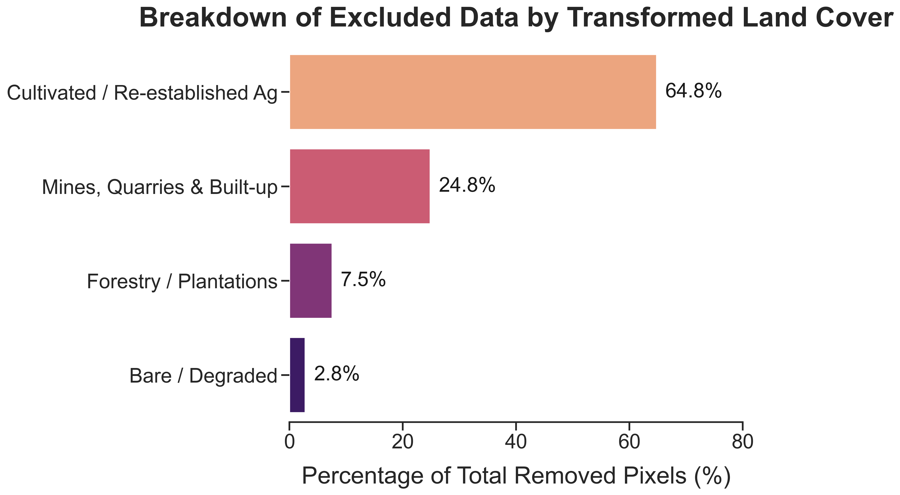
*(Note to Presenter: Shows the ~5.5 Million transformed pixels removed. The vast majority is land that returned to active cultivation.)*

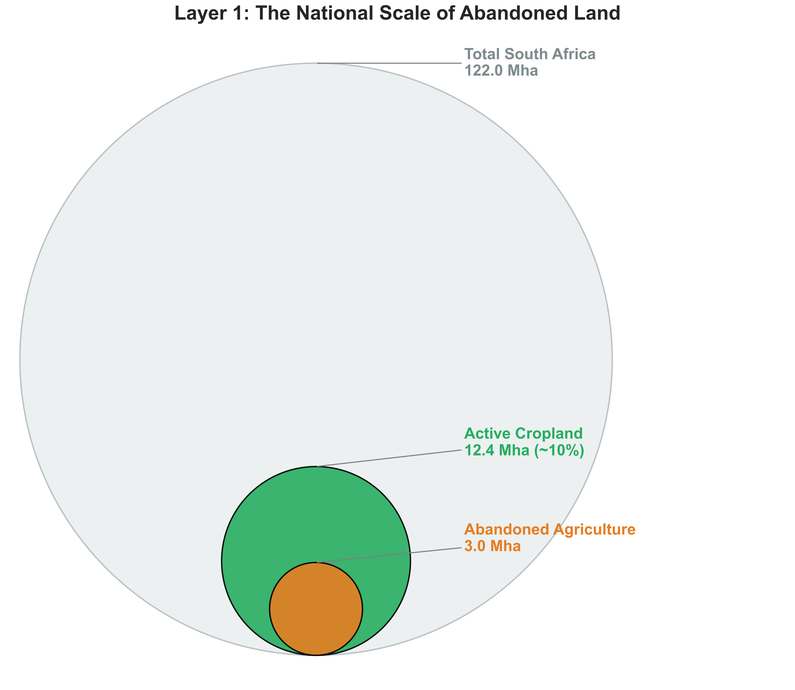
*(Note to Presenter: Nested area bubbles. SA total land: ~122 Mha. Active cropland: ~12.4 Mha (~10%). Our abandoned dataset: 3.0 Mha — an area equal to nearly a quarter of current active agriculture.)*

---

## Slide 3: Remote Sensing Variables
**Core Message:** Three complementary 30m time series capture function, structure, and latent ecology over 2000–2022.

- **Narrative:**
  - "We leveraged three recently released 30m global products:"

  - **1. Gross Primary Productivity (GPP) — Function**
    - Source: Global Pasture Watch (GPW), 30m monthly composites, summed annually.
    - Uncalibrated (relative units). Calibration was not applied because our interest is in secondary natural areas where land cover classification errors would propagate through calibration multipliers.
    - *Discussion point:* "Would calibrating GPP change the trajectory classification results, or is the relative trend robust regardless?"

  - **2. Short Vegetation Height (SVH) — Structure**
    - Source: Global Pasture Watch (GPW), 30m monthly composites.
    - Captures canopy height of the short-vegetation layer — critical for distinguishing grassland recovery from bare ground, and for detecting structural maturation.

  - **3. AlphaEarth Embeddings — Latent Ecological Identity**
    - Source: Google's AlphaEarth (SATELLITE_EMBEDDING/V1), 10m annual composites aggregated to 30m.
    - A 64-dimensional fingerprint integrating optical reflectance, radar backscatter, and seasonal phenology into a single representation.
    - Acts as a proxy for latent ecological variables (composition, heterogeneity, seasonal dynamics) that GPP and SVH cannot capture individually.

---

## Slide 4: Conceptualizing Recovery
**Core Message:** Recovery is multidimensional — greening alone is insufficient.

- **Narrative:**
  - "Now that we have these three dimensions, we can define what recovery *actually means*:"
  - "*Condition* is a snapshot in space-time. *Recovery* implies a sustained positive trajectory of that condition."
  - "True recovery isn't just getting greener. A pixel can be highly productive (high GPP) but structurally and compositionally nothing like native vegetation — think dense alien grass monocultures."
  - "We need to track convergence across all three dimensions simultaneously:"
    1. **Function** — Is the ecosystem producing biomass at natural levels?
    2. **Structure** — Is the physical canopy architecture returning?
    3. **Ecological identity** — Is the pixel converging toward what natural vegetation *looks like* across the full spectral/phenological signature?
  - "This framing naturally splits our methodology into two steps: *who* is recovering (trajectory), and *how far* they've come (degree)."

---

## Slide 5: Methodology Overview
**Core Message:** A two-step framework — first identify who is recovering, then measure how far they've come.

- **Narrative:**
  - "We split the problem into two sequential questions:"
  - **Step 1 — Trajectory Classification:** Is the pixel on a statistically significant recovery trajectory over 23 years? (Binary filter)
  - **Step 2 — Recovery Degree:** For pixels that pass Step 1, how far has recovery progressed relative to intact natural benchmarks? (Continuous score, 0–100)
  - "This separation is important: a pixel can be recovering (positive trend) but still be at a very early stage, or it can be nearly indistinguishable from mature natural vegetation."

---

## Slide 6: Step 1 — Trajectory Classification
**Core Message:** Non-parametric trend detection identifies pixels with sustained recovery signals.

- **Narrative:**
  - "For every pixel, we analyze the full 23-year GPP and SVH time series using:"
    - **Sen's slope** — a non-parametric gradient estimator, robust to outliers.
    - **Mann-Kendall test** — tests for monotonic trend significance (p < 0.05).
  - "A pixel is classified as *recovering* only if **both** GPP and SVH show a statistically significant increasing trend. This is a deliberately conservative threshold:"
    - Increasing + Significant in both = **Recovering**
    - Decreasing + Significant = **Degrading**
    - Insignificant in either = **Stable**
  - "Of ~33 million pixels, only ~2.88 million (8.6%) pass this dual-trend threshold."

- **Presenter note:** The requirement for *both* GPP and SVH to be significant is a key design choice. A pixel greening rapidly (high GPP slope) but with no structural change (flat SVH) is excluded — this filters out invasive grass monocultures that produce biomass without building native structure.

---

## Slide 7: Step 2 — Recovery Degree (Reference Sampling)
**Core Message:** Natural reference points define the target; FSCS ensures they represent the full ecological range.

- **Narrative:**
  - "To score *how recovered* a pixel is, we need to define what 'fully recovered' looks like. We used natural reference points sampled from intact vegetation within each ecoregion."
  - "Reference points were selected using **Feature Space Coverage Sampling (FSCS)** — a stratified sampling method that ensures coverage across the full multivariate feature space (64D AlphaEarth embeddings), not just geographic spread."
  - "This avoids the bias of using only strictly protected areas, which may represent a narrow slice of the natural variability within an ecoregion."
  - *Discussion point:* "What is the effect of using strictly protected areas versus FSCS? Protected areas may be biased toward certain topographies or management regimes."

---

## Slide 8: Step 2 — Recovery Degree (Scoring Metrics)
**Core Message:** Three complementary metrics capture recovery at ecoregion and local scales.

- **Narrative:**
  - "Each recovering pixel receives three percentile-normalised scores (0–100, where 50 = the natural median):"

  - **Metric A — Ecoregion Benchmark:**
    - Percentile rank of the pixel's recent GPP and SVH (2018–2022 mean) against the *entire* distribution of natural reference pixels in its ecoregion.
    - Answers: "How does this pixel compare to all natural vegetation in its ecoregion?"

  - **Metric B — Local Convergence:**
    - Ratio of the pixel's GPP/SVH to its 10 nearest natural neighbours (within 50 km), percentile-normalised.
    - Answers: "How does this pixel compare to the natural vegetation *right next to it*?"

  - **Metric C — Latent Ecological Similarity:**
    - Cosine similarity of the pixel's 64D AlphaEarth embedding to natural references, computed at both ecoregion and local (10-nearest-neighbour) scales.
    - Answers: "Beyond productivity and height, does this pixel *look like* natural vegetation across the full spectral/phenological signature?"

  - "The final **recovery score** is the mean of all metric percentiles — a single number summarising multidimensional convergence toward natural benchmarks."

---

## Slide 9: Results — National Overview
**Core Message:** Recovery is real but rare — only 8.6% of abandoned land shows significant dual-trend recovery over 23 years.

- **Narrative:**
  - "The headline numbers tell a story of progressive filtering:"
    - 3.0 Mha abandoned → 0.26 Mha with significant dual recovery trend (8.6%)
  - "Highveld Grasslands account for nearly a third of all recovering pixels, followed by Drakensberg Grasslands and Coastal Forest Mosaics."
  - **The "Green but Different" Phenomenon:** "Across ecoregions, functional recovery (GPP) consistently outpaces structural and compositional recovery. Ecosystems get green quickly but remain structurally and ecologically distinct from mature natural states. Metric C (embedding similarity) is almost always the lagging dimension."
  - "Empirically, Metric A and Metric C are *negatively correlated* (r = −0.29) across all recovering pixels, and Metric B vs C shows the same decoupling (r = −0.16). Whether measured at the ecoregion scale or locally, high productivity does not predict ecological similarity — in many cases it predicts the opposite. This validates the need for a multidimensional framework."

**Visuals:**
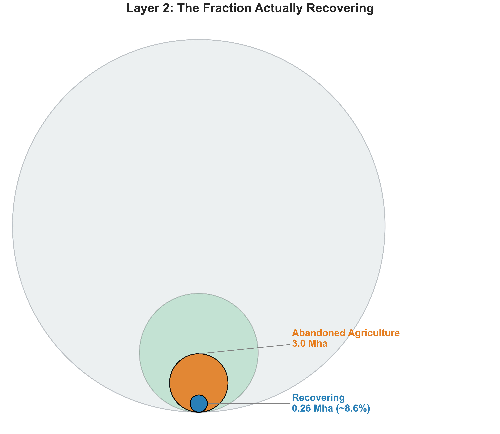
*(Note to Presenter: Context layer — 3.0 Mha abandoned, only ~0.26 Mha (8.6%) crosses the significance threshold.)*

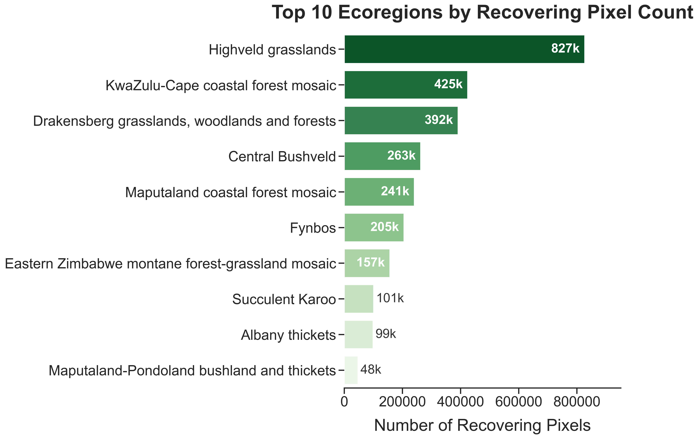

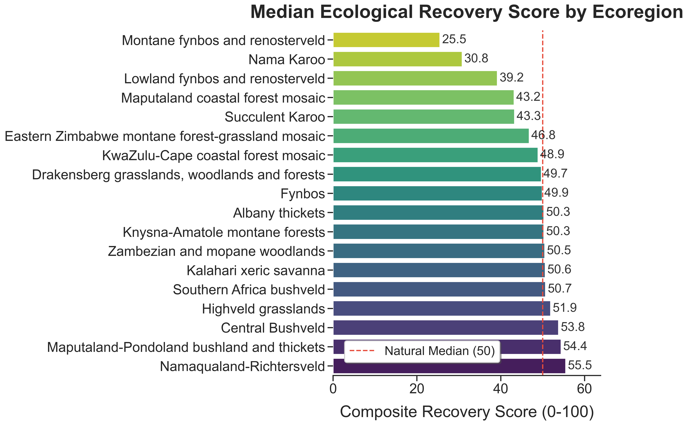

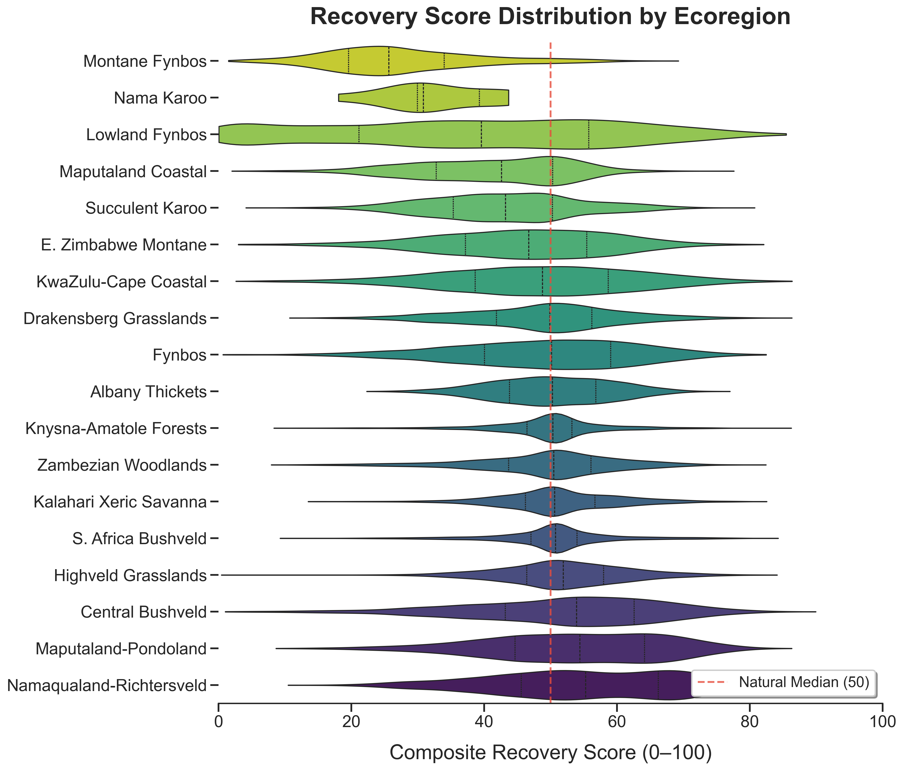
*(Note to Presenter: Violin plot showing the full distribution of recovery scores per ecoregion. Some ecoregions have long upper tails (individual pixels near full recovery), while others are tightly clustered around median. Much more informative than medians alone.)*

*(Note to Presenter: Two-panel scatter. Left: Metric A (ecoregion GPP+SVH) vs C (embedding similarity), r = −0.29. Right: Metric B (local GPP+SVH) vs C, r = −0.16. Both panels show the same decoupling — high productivity/structure does not predict ecological similarity, whether measured at the ecoregion or local scale. The bottom-right quadrant ("green but different") is densely populated, especially by Highveld Grasslands. Pixels A and D are annotated on both panels.)*

---

## Slide 10: Pixel Examples — The Recovery Gradient
**Core Message:** Four real pixels illustrate the full spectrum from early to complete recovery, and why embeddings matter.

- **Narrative:**
  - "Let's ground the statistics in real examples. These four pixels span the recovery gradient:"

  - **Pixel C — Early Recovery (Score: 24.1, Highveld Grassland):**
    - GPP and SVH both trending upward but still near the 50th percentile of natural references.
    - Embedding similarity is very low — the pixel is beginning to recover functionally but is compositionally still far from natural.

  - **Pixel A — Moderate Recovery (Score: 53.6, Highveld Grassland):**
    - Highly productive (GPP > 90th percentile of ecoregion natural references).
    - But embedding score of only 30.8 — it's *green but different*. High biomass production without converging toward native ecological identity.
    - "This is exactly the kind of pixel that would be misclassified as 'recovered' by a single-index approach."

  - **Pixel B — Advanced Recovery (Score: 82.2, Highveld Grassland):**
    - High scores across all three metrics — function, structure, and embedding similarity are all elevated.
    - Demonstrates that full convergence is achievable in grassland systems within 23 years.

  - **Pixel D — Full Recovery (Score: 94.1, Central Bushveld):**
    - GPP > 93rd percentile, embedding score of 98.8.
    - "This pixel is statistically indistinguishable from intact bushveld. It has fully rejoined the natural community across all measured dimensions."

- **Key takeaway:** "Without the embedding dimension, Pixels A and D would look equally recovered based on GPP alone. The 64D fingerprint is what separates 'green' from 'natural'."

**Visuals:**
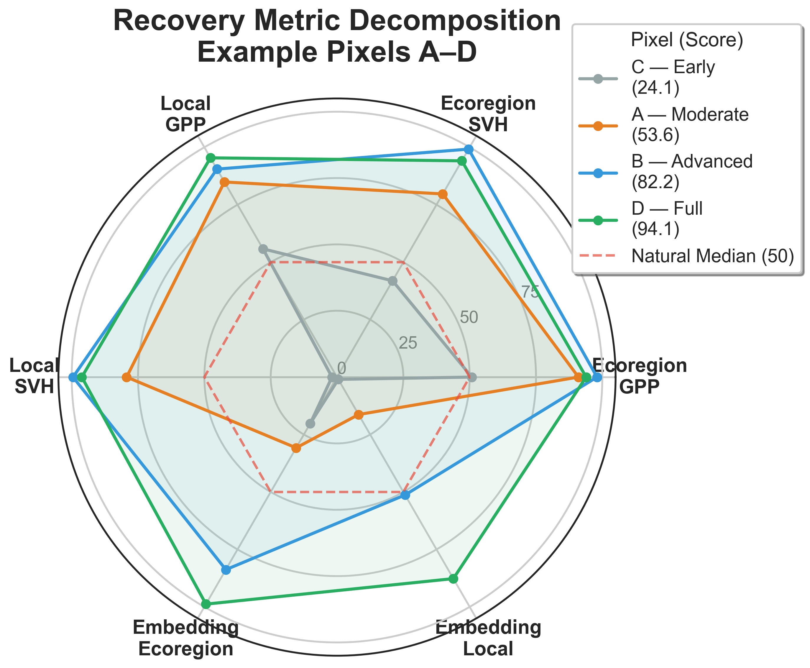
*(Note to Presenter: Radar chart showing all six metric components for pixels A–D. The visual immediately reveals that Pixel A has high GPP metrics but low embedding scores, while Pixel D is uniformly high. This is the "green but different" phenomenon in one image.)*

*Pixel A (Moderate — green but different):*
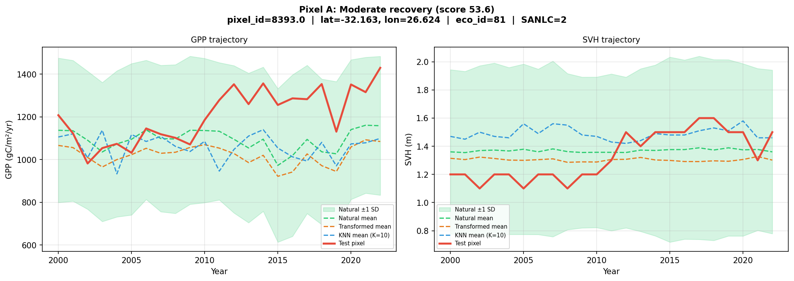
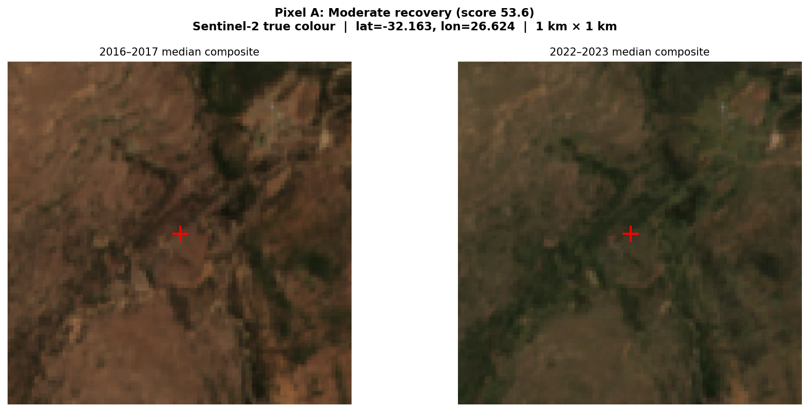

*Pixel D (Full recovery — indistinguishable from natural):*
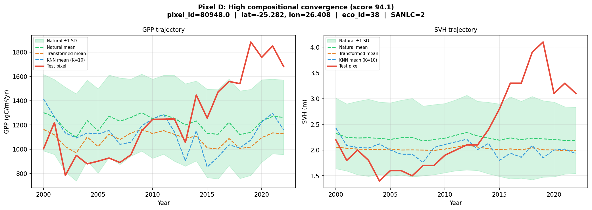
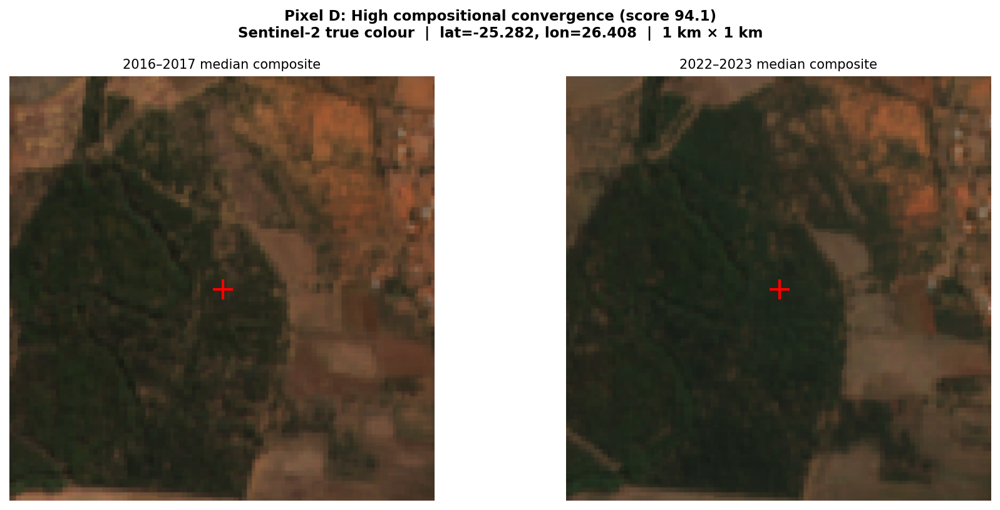

*(Presenter: Pixel B and C trajectory/satellite plots are available as backup slides if the audience wants to see the full gradient: `plots/example_trajectory_{b,c}.png`, `plots/example_satellite_{b,c}.png`)*

---

## Slide 11: The Threat of Invasive Alien Plants
**Core Message:** Nearly 1 in 4 "recovering" pixels are hijacked by alien species — inflating biomass metrics while displacing native biodiversity.

- **Narrative:**
  - "A critical complication: alien invasive plants produce biomass and build structure, so they *pass* our trajectory filter — but they are the opposite of native recovery."
  - "Cross-referencing with the NIAPS 2023 binary layer: **22.9% of all recovering pixels (661,217 pixels / ~0.06 Mha) are invaded.**"
  - "This means our final estimate of genuinely recovering, native-dominant land drops from 0.26 Mha to **~0.20 Mha**."
  - "Invasion rates vary dramatically by ecoregion — coastal and lowveld ecoregions are disproportionately affected."
  - *Discussion point:* "The NIAPS layer captures known dense stands. The true invasion extent is likely higher — scattered alien individuals below detection threshold would not be flagged. How should we caveat this?"

**Visuals:**
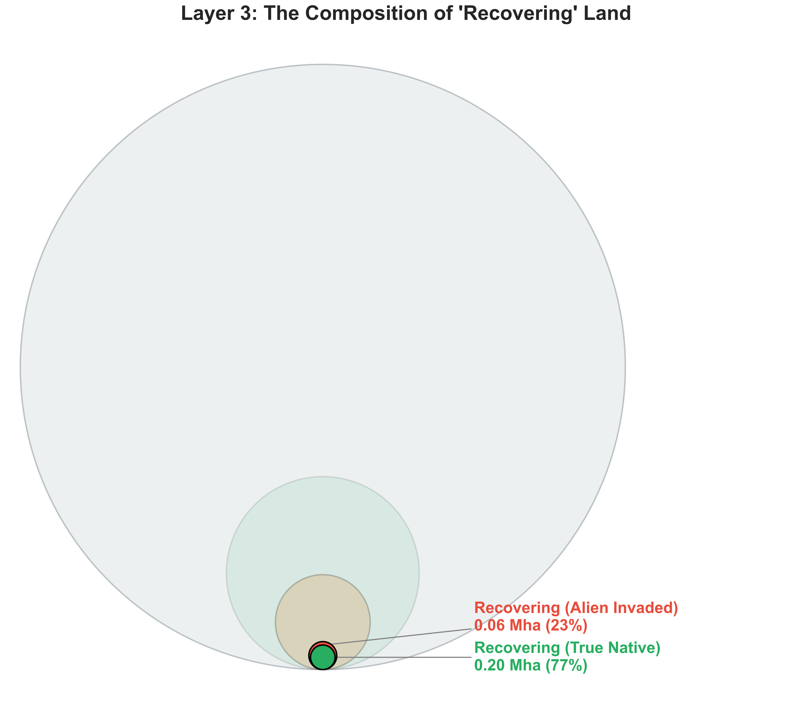
*(Note to Presenter: The full cascade — 3.0 Mha abandoned → 0.26 Mha recovering → 0.20 Mha truly native recovery.)*

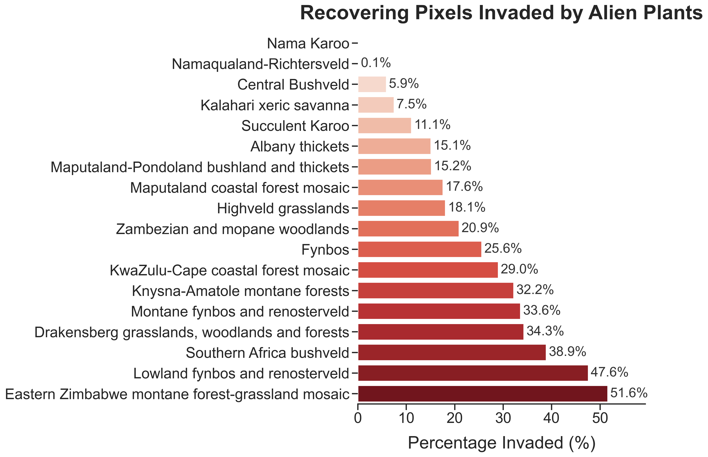

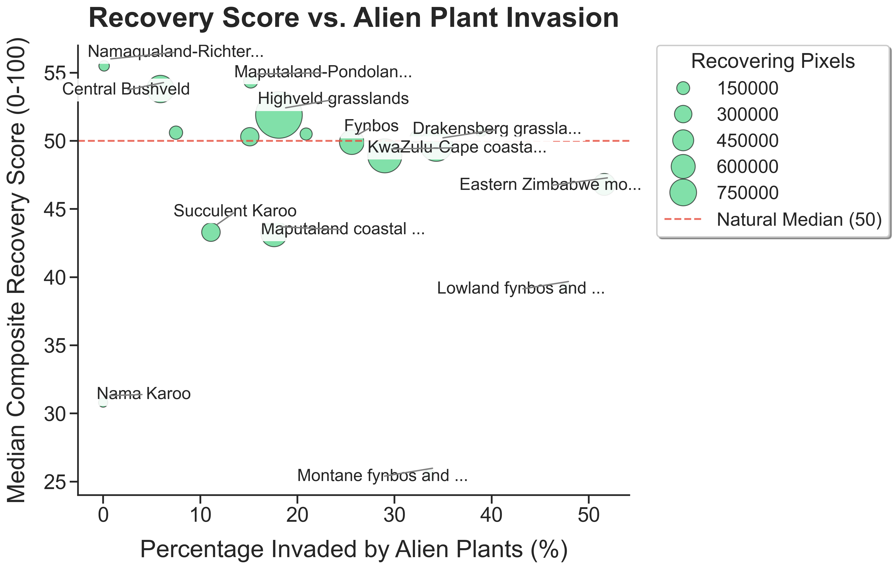
*(Note to Presenter: Bubble size = total recovering pixels in that ecoregion. X-axis = % invaded. Y-axis = median recovery score. Ecoregions in the top-left are the "winners" — high recovery, low invasion.)*

---

## Slide 12: Limitations & What Didn't Work
**Core Message:** Transparency about methodological boundaries and abandoned approaches.

- **Narrative:**
  - **Known limitations of the current approach:**
    1. **Woody plant encroachment** is not yet filtered (Venter 2018 layer planned but not applied). Bush encroachment would also inflate GPP/SVH without representing native recovery in grassland biomes.
    2. **BII masking gap:** ~5.6M pixels (~14.5%) were dropped during extraction due to the 1km Biodiversity Intactness Index layer having no data at certain locations. This is a known spatial bias.
    3. **Embedding tile boundaries:** 1,639 pixels (0.13%) at integer-degree boundaries have no AlphaEarth data — structural gap, not retryable.
    4. **Validation is incomplete:** We have internal consistency checks but no independent ground-truth validation of recovery scores against expert assessments or field data.

  - **Approaches we explored and set aside:**
    - **HCAS (Ecosystem Condition Index):** Implemented a version, but condition scores were unrealistically low. An official R package is upcoming from the original authors — worth revisiting.
    - **Distance metrics from transformed baselines:** Raw Euclidean/Manhattan distances on GPP, SVH, and embeddings from known transformed categories. Saturated quickly and couldn't separate semi-natural from natural.
    - **DNN alignment (RLHF-style):** Attempted to train a neural network to predict HCAS scores from AlphaEarth embeddings. The base HCAS predictions were too noisy, so the alignment model inherited that noise.

---

## Slide 13: Synthesis & Policy Relevance
**Core Message:** Passive recovery alone yields ~0.20 Mha over 23 years — a drop in the bucket for 30x30 targets.

- **Narrative:**
  - "Pulling the numbers together:"
    - SA total land: ~122 Mha
    - Historic abandoned agriculture: ~3.0 Mha
    - Statistically recovering (both GPP & SVH): ~0.26 Mha (8.6%)
    - After removing invasives: **~0.20 Mha of genuinely recovering native secondary land**
  - "Returning to where we started: the 30x30 target requires ~30% of land under effective conservation by 2030. Passive abandonment is yielding 0.20 Mha of measurably recovering land over 23 years in South Africa."
  - "This is not a critique of passive recovery — it demonstrates that passive processes alone, even over decades, produce limited area of ecologically meaningful recovery. **Active restoration investment is essential to meet national and global targets.**"
  - "However, the 0.20 Mha that *is* recovering represents natural ecological processes succeeding without intervention — understanding *where* and *why* these pixels succeed is valuable for targeting restoration efforts."

**Visuals:**
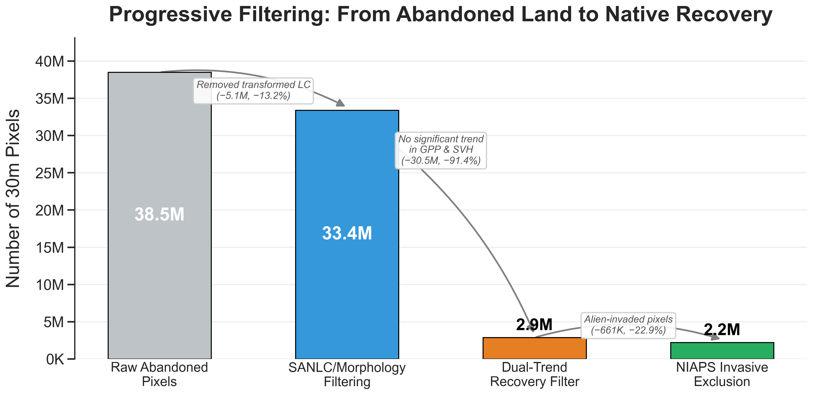
*(Note to Presenter: Waterfall chart showing the progressive narrowing: 38.5M raw pixels → 33M after SANLC/NIAPS filtering → 2.88M with significant dual recovery → 2.22M after invasive exclusion. Each step has the count and the percentage lost. A single visual that tells the entire filtering story.)*

---

## Slide 14: Future Work & Discussion
**Core Message:** Strategic priorities given timeline constraints.

- **Narrative:**
  - **Priority 1 — Timeline:** "I am working on this full-time at NINA until the 20th. After that, it becomes a secondary priority, so we must be strategic about what to finalize."

  - **Immediate technical work (before the 20th):**
    1. Apply Venter 2018 WPE filter to exclude bush encroachment pixels.
    2. Generate a spatial map of recovery scores (GeoTIFF export exists: `trajectory_classification_30m.tif`) — critical visual for the paper.
    3. Sensitivity analysis: compare FSCS reference sampling vs protected-area-only references for a subset of ecoregions.

  - **Paper direction — open discussion:**
    - *Option A: Methodological framework* — "A generalizable multidimensional recovery scoring framework using freely available 30m global products."
    - *Option B: Regional ecological findings* — "Patterns, drivers, and barriers to ecological recovery on abandoned agriculture in South Africa."
    - *Option C: Dataset/tool paper* — "A national 30m recovery assessment dataset for South Africa, 2000–2022."
    - "Given that we have a working pipeline across 18 ecoregions with three novel metrics and a clear policy hook (30x30), which framing best serves the collaboration?"

  - **Longer-term:**
    - Validate recovery scores against expert rankings or field data.
    - Test the framework in other geographies (e.g., using HCAS when the R package is released).
    - Investigate ecoregion-specific recovery rates and drivers (climate, proximity to seed sources, soil type).
